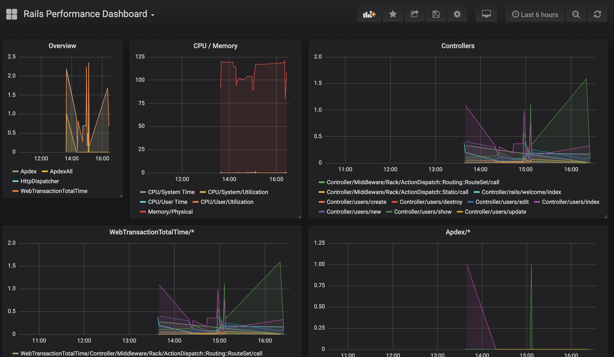
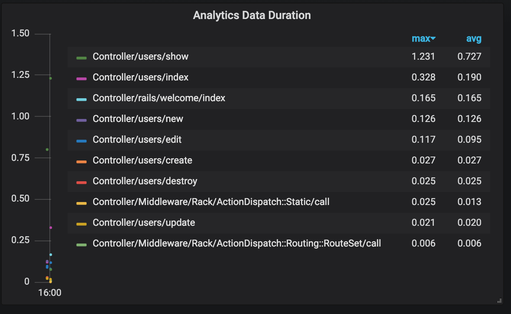

# Local RPM collector for newrelic_rpm gem

Collect metrics from your app on development environment.

## Usage

Check & execute `run.sh`
It is responsible for:
1. starting required docker containers (using docker compose)
2. creating InfluxDB database (if not exists) 

Prepare your Rails app:
1. Install RPM gem
2. Add monkeypatch so non-ssl collector is allowed (check `rails-config/`)
3. Adjust configuration (`newrelic.yml`) so it points to the local collector

Prepare Grafana:
1. Visit grafana (http://localhost:3001) (default user/password: admin)
2. Import `grafana-rails-performance-dashboard.json`

## Demo

